# Spring Boot Hello World with Docker

[](https://openjdk.org/projects/jdk/17/)
[](https://spring.io/projects/spring-boot)
[](https://www.docker.com/)
[](LICENSE)

A minimal Spring Boot API — one endpoint that answers `Hello, World!` — packaged as a Docker image with a multi-stage `Dockerfile`.

The application is deliberately trivial: the point of the project is the packaging. I built it to practice how a Java application becomes a container image, following the Docker part of Fernanda Kipper's video [*Aprendendo Docker — Empacotando API Java Spring + deploy na AWS*](https://www.youtube.com/watch?v=l9k_tWRTX7k) ([her repository](https://github.com/Fernanda-Kipper/spring-hello-world-docker)). The deployment to AWS shown in the video is not part of this project.

## Tech stack

- **Java 17**
- **Spring Boot 3.4.3** — Spring Web
- **Docker**, with a multi-stage build
- **JUnit 5** and **MockMvc** for the tests
- **Maven**, through the Maven Wrapper (`./mvnw`)

## Endpoint

| Method | Path | Response |
|---|---|---|
| `GET` | `/api/hello` | `Hello, World!` |

The application listens on port **9090**, set in `src/main/resources/application.properties`.

## The Dockerfile

<p align="center"><a href="docs/docker-build.svg"></a></p>

The image is built in **two stages**, and only the second one becomes the final image:

1. **Build** (`maven:3.9-eclipse-temurin-17`) has Maven and a full JDK. It copies `pom.xml` and downloads the dependencies *before* copying the sources, so Docker caches that layer: changing the code does not download the dependencies again. Then it copies `src/` and runs `mvn package`.
2. **Runtime** (`eclipse-temurin:17-jre-alpine`) has only a Java runtime. It receives the jar from the first stage with `COPY --from=build` and runs it.

Maven, the JDK and the sources stay behind in the first stage, so the final image is smaller and carries only what running the application needs.

## Running it

Requirements: **Java 17**, or only **Docker** for the last option. Maven does not need to be installed.

**With Maven:**

```bash
./mvnw spring-boot:run
```

**From the jar:**

```bash
./mvnw clean package
java -jar target/hello-world-0.0.1-SNAPSHOT.jar
```

**With Docker:**

```bash
docker build -t spring-boot-docker-hello-world .
docker run -d --name hello-world -p 9090:9090 spring-boot-docker-hello-world
```

Then:

```bash
curl http://localhost:9090/api/hello
```

To use another port, set `SERVER_PORT` — for example `SERVER_PORT=8081 ./mvnw spring-boot:run` — or, with Docker, map a different host port: `-p 8081:9090`.

## Tests

```bash
./mvnw test
```

- **`HelloWorldControllerTest`** calls `GET /api/hello` through **MockMvc** and checks the status and the body. MockMvc sends the request through Spring MVC's dispatcher — routing, controller, response — without starting Tomcat or opening a port, which keeps the test fast.
- **`HelloWorldApplicationTests`** checks that the Spring context starts and that the controller is in it.

A single test class runs with `./mvnw test -Dtest=HelloWorldControllerTest`.

## Diagrams

Click a diagram to open it at full size. The diagram is generated from the Mermaid source in `docs/`, so it stays editable text rather than a binary image:

```bash
npx @mermaid-js/mermaid-cli -i docs/docker-build.mmd -o docs/docker-build.svg -t default -b white -c docs/mermaid-config.json
```

## License

Licensed under the [MIT License](LICENSE).

## Contact

Nathan Paiva de Lacerda — [LinkedIn](https://www.linkedin.com/in/nathan-paiva-636336236)
